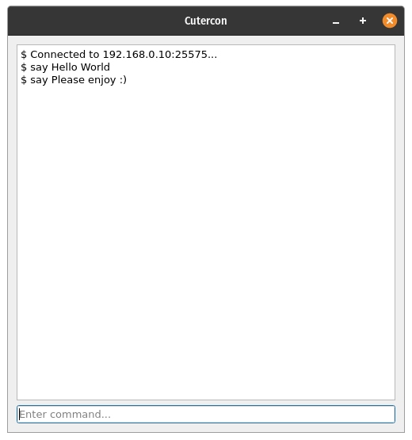

#  Cutercon : Minecraft Remote Console Program 

A remote console written in Python, using Qt6 for the GUI.



## Minecraft Remote Console Protocol

[RCON](https://wiki.vg/RCON) is a TCP/IP-based protocol that allows server administrators to remotely execute Minecraft commands.

## Usage

This client can be run as a standalone script with the PyQt GUI, or by importing the Cutercon class and doing whatever you'd like.

Example:

```python
from cutercon import Cutercon

# Note that port 25575 is the default Minecraft RCON port.
HOST = "192.168.0.10"
PASSWORD = "password"
PORT = 25575

with Cutercon(HOST, PASSWORD, PORT) as rcon:
    rcon.command("say Hello World")
```

## License

MIT License

Copyright (c) 2021 Kareem Stephan Skinner

Permission is hereby granted, free of charge, to any person obtaining a copy
of this software and associated documentation files (the "Software"), to deal
in the Software without restriction, including without limitation the rights
to use, copy, modify, merge, publish, distribute, sublicense, and/or sell
copies of the Software, and to permit persons to whom the Software is
furnished to do so, subject to the following conditions:

The above copyright notice and this permission notice shall be included in all
copies or substantial portions of the Software.

THE SOFTWARE IS PROVIDED "AS IS", WITHOUT WARRANTY OF ANY KIND, EXPRESS OR
IMPLIED, INCLUDING BUT NOT LIMITED TO THE WARRANTIES OF MERCHANTABILITY,
FITNESS FOR A PARTICULAR PURPOSE AND NONINFRINGEMENT. IN NO EVENT SHALL THE
AUTHORS OR COPYRIGHT HOLDERS BE LIABLE FOR ANY CLAIM, DAMAGES OR OTHER
LIABILITY, WHETHER IN AN ACTION OF CONTRACT, TORT OR OTHERWISE, ARISING FROM,
OUT OF OR IN CONNECTION WITH THE SOFTWARE OR THE USE OR OTHER DEALINGS IN THE
SOFTWARE.
